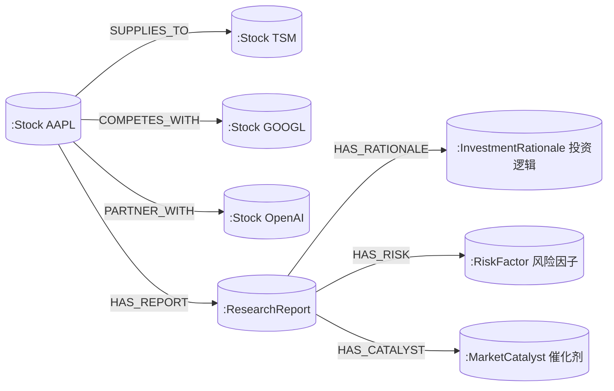

# Gems & DailyStock 项目算法与多模态数据架构白皮书
*(Project Algorithm & Multimodal Data Architecture Whitepaper)*

---

## 目录
1. [系统整体数据库架构与协同关系](#1-系统整体数据库架构与协同关系)
2. [Neo4j 图数据库四大类关键关系模型](#2-neo4j-图数据库四大类关键关系模型)
3. [量化选股与操盘 5 大维度核心数据与业务逻辑](#3-量化选股与操盘-5-大维度核心数据与业务逻辑)
4. [闭环胜率评估算法与 AI 自愈进化机制](#4-闭环胜率评估算法与-ai-自愈进化机制)

---

## 1. 系统整体数据库架构与协同关系

系统采用了 **NoSQL 文档数据库 + 关系图数据库 + 对象存储 + 内存级熔断缓存** 的异构多模态存储架构。各数据库分工极其明确，彼此互补：

| 存储组件 | 数据库类型 | 核心职责与保存的内容 |
| :--- | :--- | :--- |
| **Google Cloud Firestore** | NoSQL 文档数据库 *(核心业务主库)* | • **用户与权限**：用户 Profile (`users/`)、身份鉴权、订阅等级。 • **研报与历史归档**：每日盘前简报 (`reports/`)、每周审计周报 (`weekly_cache/`)、宏观分析 (`macro_cache/`)、财报拆解 (`earnings_reports/`)。 • **策略与快照**：Gems 策略快照 (`gems_rebalance_snapshots/`)、自选股列表 (`stock_pool`)。 • **系统配置**：龙头股权重表、SRE 健康探针状态 (`system_status`)。 |
| **Neo4j (AuraDB)** | 图数据库 *(Graph RAG)* | • **产业链与上下游拓扑**：如 AAPL $\rightarrow$ TSM（代工关系）、NVDA $\rightarrow$ TSMC $\rightarrow$ ASML。 • **多跳关联图谱 (Multi-Hop Topologies)**：板块传导效应、竞争对手替代关系、因果传导路径。 • **AI 研报上下文增强**：为 Gemini 生成深度研报提供图谱拓扑信息。 |
| **Firebase Storage** | 对象存储 (Object Storage) | • **媒体与渲染产物**：生成的微信公众号预览页 HTML、动态渲染的 PNG K线与研报分享卡片。 |
| **内存/本地缓存** | In-Memory Cache | • **高频行情缓存**：FMP API 价格、VWAP、SMA 缓存。 • **Circuit Breaker 熔断降级**：外部 API 故障时的自动降级保护。 |

---

## 2. Neo4j 图数据库四大类关键关系模型

除传统的“上下游供应链”外，系统在 Neo4j 中构建了完整的 **4 大类核心关系拓扑**：

1. **上下游供应链关系 (`SUPPLIES_TO` / `CUSTOMER_OF`)**：记录芯片晶圆代工、组装厂、核心零部件供应商关系（例如 `AAPL -[SUPPLIES_TO]-> Foxconn`）。
2. **行业竞争与竞品关系 (`COMPETES_WITH`)**：记录同赛道对标竞品（例如 `NVDA -[COMPETES_WITH]-> AMD`、`MSFT -[COMPETES_WITH]-> GOOGL`），当巨头发生财报异动时推导竞品连带影响。
3. **深度战略合作伙伴关系 (`PARTNER_WITH`)**：记录非买卖关系的资本与生态联盟（例如 `MSFT -[PARTNER_WITH]-> OpenAI`）。
4. **研报质性逻辑与事件因子图谱 (Report & Event Knowledge Graph)**：包含研报概览与评分、看多/看空核心投资逻辑、主要风险因子、股价催化剂。

---

## 3. 量化选股与操盘 5 大维度核心数据与业务逻辑

系统中设计的量化选股与操盘引擎由 **5 大数据维度** 协同驱动：

1. **宏观经济与流动性维度 (Macro & Liquidity Factors)**：美联储基准利率 (FFR)、CPI/PCE 通胀、NFP 非农就业、美债 10Y-2Y 收益率倒挂利差。倒挂/高利率环境下自动调紧安全边际；降息预期开启时调高 Small-Cap Growth 权重。
2. **定量基本面评分维度 (Quantitative Fundamental Scoring)**：根据 Profitability (30%) + Growth (40%) + Safety & Cash Flow (30%) 计算 0-100 的 **Fundamental Score**。
3. **技术面与动量量化维度 (Technical Momentum & Trend)**：Price vs 50SMA/200SMA 偏离度、52 周高低点位置 (Proximity to 52-Week High)、RSI (14)、MACD。
4. **财报预期差与机构/内幕资金面 (Earnings Surprises & Capital Flow)**：财报超预期幅度 (Earnings Surprise % > 15%)、华尔街目标价上修空间。
5. **战术再平衡与闭环评估 (Tactical Rebalancing & Closed-Loop Evaluator)**：基于标的 Beta、波动率及策略权重，计算持仓再平衡优化比例。

---

## 4. 闭环胜率评估算法与 AI 自愈进化机制

系统内置了自动化的 **Strategy Evaluator** 与 **Self-Healing Loop**：

### ① 胜率计算公式与时间窗口 (Evaluation Horizons)
- **T+5 短线胜率**：推荐后第 5 个交易日的胜率。
- **T+20 中线胜率**：推荐后第 20 个交易日的胜率（通常高于 T+5，因为优质基本面需要时间兑现）。

$$\text{胜率 (Win Rate)} = \frac{\text{成功单数量 (持股周期内收益率 > 0)}}{\text{总推荐标的数量}} \times 100\%$$

$$\text{盈利单平均收益} = \frac{\sum \text{所有盈利单的收益率}}{\text{盈利单总数量}}$$

### ② 期望收益率与盈亏比公式 (System Expectancy)

$$\text{单均期望收益} = (\text{胜率} \times \text{盈利单平均收益}) - (\text{败率} \times \text{亏损单平均亏损})$$

在 **71.4% 胜率**、**+8.4% 盈利单平均收益** 下，数学期望收益率高达 **+4.86%**，证明策略具备优异的盈亏比。

### ③ 策略健康度与 AI 自愈机制 (Autonomous Self-Healing Loop)
- **`OPTIMAL` 状态 ($\ge 55\%$)**：保持当前量化过滤参数。
- **`WARNING` 状态 ($< 50\%$)**：触发 **AI 自愈进化机制**，系统自动实施干预（如：提高 ROE 门槛从 15% 升至 20%，调紧资产负债限制），并在 `/audit` 页面中公开自愈日志与复盘红黑榜。
