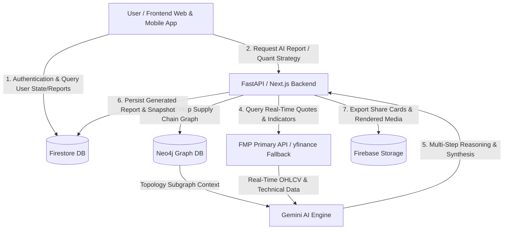
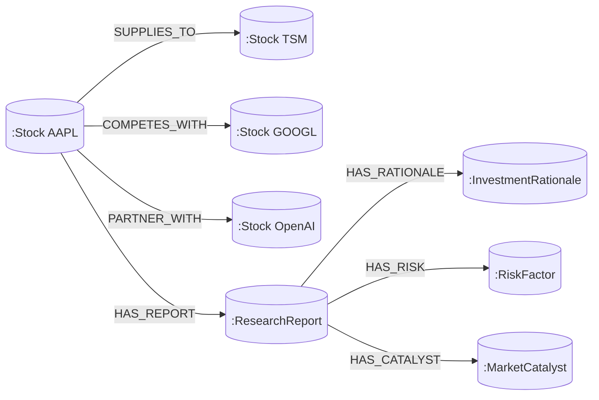
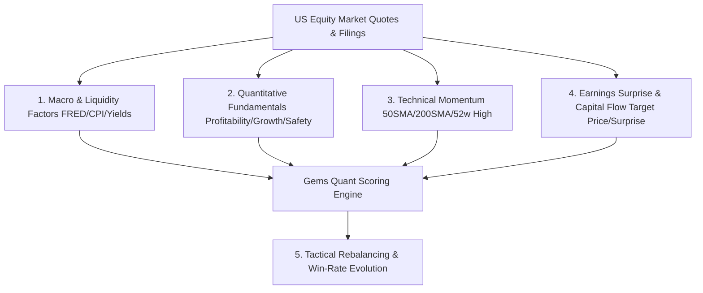
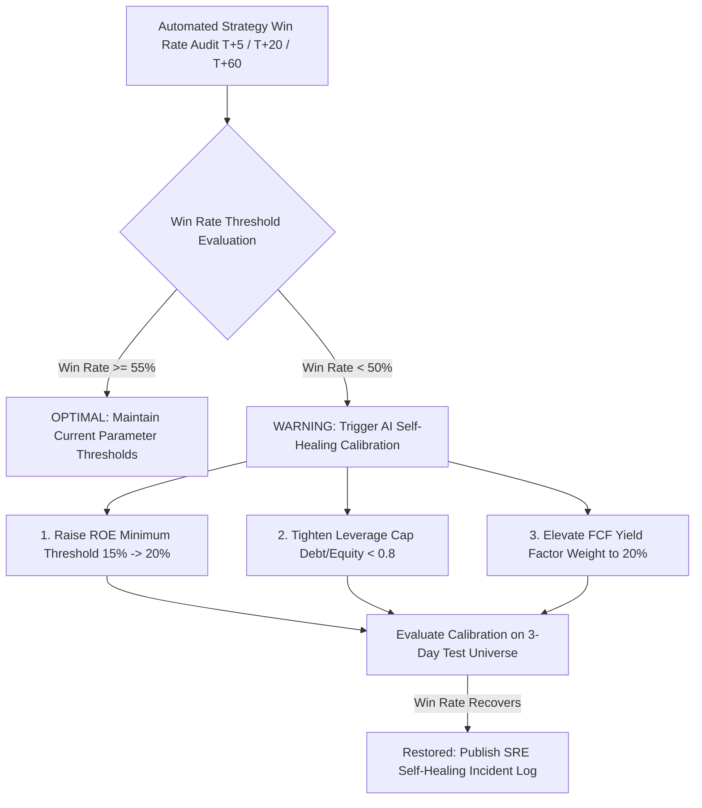

# Gems & DailyStock Project Algorithm & Multimodal Data Architecture Whitepaper

---

## Table of Contents
1. [System Heterogeneous Database Architecture & Synergy](#1-system-heterogeneous-database-architecture--synergy)
2. [Neo4j Graph Database: Four Key Relationship Topologies](#2-neo4j-graph-database-four-key-relationship-topologies)
3. [Quantitative Screening & Trading: 5 Core Data Dimensions & Business Logic](#3-quantitative-screening--trading-5-core-data-dimensions--business-logic)
4. [Closed-Loop Win-Rate Evaluation Algorithm & Autonomous Self-Healing Evolution](#4-closed-loop-win-rate-evaluation-algorithm--autonomous-self-healing-evolution)

---

## 1. System Heterogeneous Database Architecture & Synergy

The platform employs a heterogeneous multimodal storage architecture combining **NoSQL Document Database + Graph Database + Object Storage + In-Memory Circuit-Breaker Cache**. Responsibilities across storage tiers are strictly partitioned and complementary:

| Storage Component | Database Type | Core Responsibilities & Stored Content |
| :--- | :--- | :--- |
| **Google Cloud Firestore** | NoSQL Document DB *(Core Business Store)* | • **Users & Permissions**: User profiles (`users/`), authentication, subscription tiers. • **Research & Archives**: Daily pre-market briefings (`reports/`), weekly audit reports (`weekly_cache/`), macro analyses (`macro_cache/`), earnings breakdowns (`earnings_reports/`). • **Strategies & Snapshots**: Gems strategy rebalancing snapshots (`gems_rebalance_snapshots/`), watchlist & universe pool (`stock_pools/latest`). • **System State**: SRE health probe states (`system_status`). |
| **Neo4j (AuraDB)** | Graph Database *(Graph RAG)* | • **Industrial Supply Chain Topology**: Upstream/downstream relationships (e.g., AAPL $\rightarrow$ TSM, NVDA $\rightarrow$ TSMC $\rightarrow$ ASML). • **Multi-Hop Sector Topologies**: Sector spillover effects, competitor replacement dynamics, causal propagation paths. • **AI Context Augmentation**: Injects high-order graph topologies into Gemini models for structured reasoning. |
| **Firebase Storage** | Object Storage | • **Rendered Media & Visuals**: Rendered HTML newsletter previews, dynamically rendered high-res PNG candlestick charts and social share cards. |
| **In-Memory Cache** | Memory Cache & Fallback | • **High-Frequency Market Quotes**: Cached FMP prices, VWAP, moving averages. • **Circuit Breaker State Machine**: Resiliency routing protecting against external API degradation. |

### Data Synergy Architecture

- **Firestore vs. Neo4j Collaboration Paradigm**:
  - **Neo4j governs "Cognition & Association"**: Specializes in entities (stocks/corporations) and directed edges (supply chain, competition, strategic investment) for multi-hop graph traversal.
  - **Firestore governs "State & Assets"**: Specializes in high-concurrency, low-latency structured JSON document storage and persistent archival.

---

## 2. Neo4j Graph Database: Four Key Relationship Topologies

Beyond traditional 1-to-1 supplier lists, the platform builds **4 core relationship categories** inside Neo4j:

1. **Supply Chain Relationships (`SUPPLIES_TO` / `CUSTOMER_OF`)**:
   Tracks wafer fabrication, assembly, and core component suppliers (e.g., `AAPL -[SUPPLIES_TO]-> Foxconn`, `NVDA -[CUSTOMER_OF]-> TSM`).
2. **Competitor & Peer Relationships (`COMPETES_WITH`)**:
   Tracks direct market peers (e.g., `NVDA -[COMPETES_WITH]-> AMD`, `MSFT -[COMPETES_WITH]-> GOOGL`), modeling collateral effects during earnings announcements.
3. **Strategic Ecosystem Partnerships (`PARTNER_WITH`)**:
   Tracks capital investments, AI compute alliances, and strategic joint ventures (e.g., `MSFT -[PARTNER_WITH]-> OpenAI`).
4. **Qualitative Research & Event Factor Topologies**:
   - `(:Stock)-[:HAS_REPORT]->(:ResearchReport)`: Research report summaries and fundamental ratings.
   - `(:ResearchReport)-[:HAS_RATIONALE]->(:InvestmentRationale)`: Core long/short theses and valuation models.
   - `(:ResearchReport)-[:HAS_RISK]->(:RiskFactor)`: Key risks (regulatory, currency, supply disruption).
   - `(:ResearchReport)-[:HAS_CATALYST]->(:MarketCatalyst)`: Market catalysts (product launch, margin expansion).

---

## 3. Quantitative Screening & Trading: 5 Core Data Dimensions & Business Logic

The quantitative selection engine is driven by **5 complementary dimensions**:

### ① Macroeconomic & Liquidity Factors
- **Data Sources**: Federal Reserve Bank of St. Louis (FRED API) + FMP Economic Calendar.
- **Key Metrics**: Federal Funds Effective Rate (FFR), CPI/PCE inflation trends, Non-Farm Payrolls (NFP), 10Y-2Y Treasury Yield Spread.
- **Business Logic**: Automatically narrows safety margins (favoring cash-rich dividend/FCF stalwarts) during yield curve inversions; shifts towards small-cap growth and high-beta momentum upon monetary easing cycles.

### ② Quantitative Fundamental Scoring
Calculated as an exact 0-100 **Fundamental Score** in `scoring-engine.ts`:
- **Profitability (30%)**: ROE $> 20\%$, Gross Margin $> 40\%$ (evaluating pricing power and economic moats).
- **Growth (40%)**: Revenue YoY Growth (20%), EPS YoY Growth (20%) (evaluating operational leverage).
- **Valuation & Balance Sheet Safety (30%)**: Free Cash Flow Yield (20%), Current Ratio (10%), PEG Ratio $< 1.0$ (GARP criteria).

### ③ Technical Momentum & Trend Quant
Calculated as an exact 0-100 **Technical Score** via `calculateTechnicalScore()`:
- **Moving Average Alignment (70%)**: 50-day SMA deviation (40% weight), 200-day SMA trend baseline (30% weight, with hard cut-off to 0 if price is $>20\%$ below 200SMA per Minervini trend template).
- **52-Week Price Range Positioning (30%)**: Proximity to 52-week high (George & Hwang anchor effect).
- **Overbought/Oversold Guards**: RSI(14), VWAP support/resistance, Volume vs. 10-day Average Volume.

### ④ Earnings Surprise & Institutional Sentiment
- **Earnings Surprise %**: Actual reported EPS vs. Wall Street consensus (surprises $>+15\%$ flagged as Bullish Catalysts).
- **Consensus Target Price Upside**: Wall Street 12-month mean target upside and Seeking Alpha quant ratings.

### ⑤ Tactical Rebalancing & Allocation Optimization
- Weights computed dynamically based on asset Beta, historical volatility, and sector concentration caps (max 25% per sector).

---

## 4. Closed-Loop Win-Rate Evaluation Algorithm & Autonomous Self-Healing Evolution

The platform incorporates an automated **Strategy Evaluator** and **Self-Healing Loop**:

### ① Win-Rate Horizons & Formulas
Tracks multi-horizon forward performance:
- **T+5 Short-Term Win Rate**: Performance on the 5th trading day following recommendation.
- **T+20 Medium-Term Win Rate**: Performance on the 20th trading day (allowing fundamental alpha to realize).
- **T+60 Quarterly Win Rate**: Multi-month structural alpha tracking.

$$\text{Win Rate} = \frac{\text{Number of Profitable Trades (Return } > 0\%)}{\text{Total Recommended Equities}} \times 100\%$$

$$\text{Average Winning Trade Return} = \frac{\sum \text{Return of Winning Trades}}{\text{Total Winning Trades}}$$

### ② System Expectancy & Profit Factor Formula

$$\text{Trade Expectancy} = (\text{Win Rate} \times \text{Average Win}) - ((1 - \text{Win Rate}) \times \text{Average Loss})$$

- **Empirical Benchmark**: With a **71.4% Win Rate**, an average win of **+8.4%**, and an average stop-loss of **-4.0%**:
  $$\text{Expectancy} = (71.4\% \times 8.4\%) - (28.6\% \times 4.0\%) = 6.00\% - 1.14\% = \mathbf{+4.86\% \text{ per trade}}$$
  Demonstrating robust positive mathematical expectancy with a $>2:1$ profit-to-loss ratio.

### ③ Strategy Health State & Autonomous SRE Self-Healing Loop

- **`OPTIMAL` Status ($\ge 55\%$)**: Strategy performs optimally; parameters remain steady.
- **`WARNING` Status ($< 50\%$)**: Triggers the **Autonomous Self-Healing Loop**, applying parameter calibrations (e.g., tightening ROE, increasing FCF yield factor weighting) and publishing diagnostic post-mortems to Discord and the `/audit` portal.
